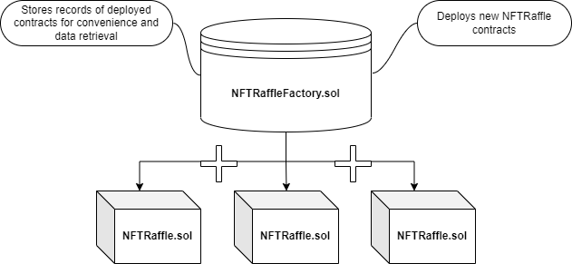
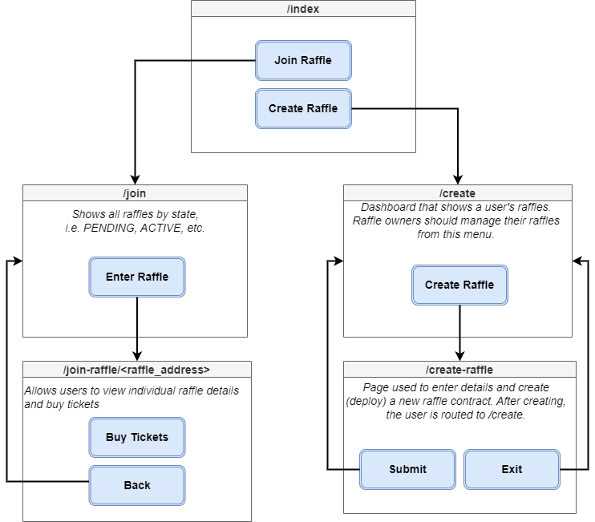

# ISYS-4453-NFTRaffle

 As a final term project in our ISYS-4453 Blockchain Development class, we chose to create a decentralized NFT raffle platform using the Ethereum blockchain. 
 
 The platform allows users to create and join raffles for ERC721 NFTs. The raffles are secured by an escrow contract that receives the ERC721 NFT and holds it for the duration of the raffle.
 During the raffle, users can purchase tickets for the predetermined price. Once the raffle is over, the winner is chosen at random using the linear congruential generator, and the NFT is sent to the winner and funds send to the Raffle owner. *For a detailed overview of the smart contract functionality, see the contract design flows below.*

 To interact with these contracts at a high level, we have created a frontend using React and Next.js. The site was styled using bootstrap and other frameworks. The site is hosted on Vercel with full functionality.

## Problems Addressed:
- Centralized Raffles are not trustless, and can be manipulated by the raffle organizer. (e.g. the organizer can choose the winner, or not pay out the prize)
- Centralized Raffles are not immutable, and can be changed by the raffle organizer. (e.g. the organizer can change the prize, or change the rules of the raffle, or cancel the raffle altogether without the consent of the participants)

## NFT Collection Used for Testing (Mumbai):

https://testnets.opensea.io/collection/digital-liminal-spaces

## Randomisation Method:

[Linear Congruential Psuedorandom Number Generator](https://en.wikipedia.org/wiki/Linear_congruential_generator)

## NFTRaffle Contract Design Flow:
 

### [**NFTRaffleFactory.sol**](blockchain/contracts/NFTRaffleFactory.sol)
* This contract should be used as the gateway to deploy and track NFTRaffle contracts.
* Raffles are created using the `createRaffle()` method.
* Convenience functions include:
    - `fetchRafflesByState()` - Returns an array of raffle addresses based on the state passed in (E.g. PENDING, ACTIVE, SETTLED, CANCELLED).
    - `fetchRafflesByOwner()` - Returns an array of raffle addresses based on the owner address passed in.
    - `raffles` array that contains `Raffle` structs to track:
        * The raffle ID (for internal storage purposes)
        * The raffle contract address
        * The creation timestamp
        * The Raffle owner's address
        * The Raffle owner's ownerEmail

### [**NFTRaffle.sol**](blockchain/contracts/NFTRaffle.sol)
1. `Constructor()` instantiates the NFTRaffle contract with all required data, but DOES NOT yet receive the NFT. (this is called by the Factory contract)
    - This is because the NFTRaffle contract must be approved to spend the NFT by the owner.
2. The owner approves the contract to spend the ERC721 NFT with the recently deployed NFTRaffle contract's address.
    * This is so that the NFTRaffle contract can call the ERC721.safeTransferFrom() method to receive the NFT, and send it to the winner once the raffle is over.
    * This should be implemented in the interface once the contract is deployed.
3. The owner calls the `startRaffle()` method
    - Transfers the NFT from the owner to the NFTRaffle escrow contract.
    - Starts the timer on the raffle.
    - Users can now purchase tickets to the raffle.
4. Until a ticket is purchased, the `cancelRaffle()` can be called, which will cancel the raffle and turn the NFT back over to the owner. However, as soon as a ticket is purchased this method is voided.
5. Once the specified amount of time has passed (set as `duration` in the constructor), users will not be able to buy more tickets. 
    - At this point, the `settleRaffle()` method should be called, which does the following: 
        1. Checks that at least 1 ticket was purchased, if not, the `cancelRaffle()` function should be called to return the NFT to the owner. 
        2. Draws a winning ticket using the randomisation method.
        3. Transfers the NFT to the winner.
        4. Transfers the raised funds to the Raffle owner.

## Web Design Flow:

